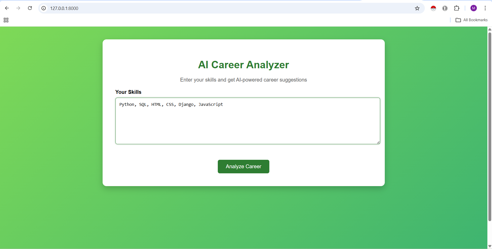
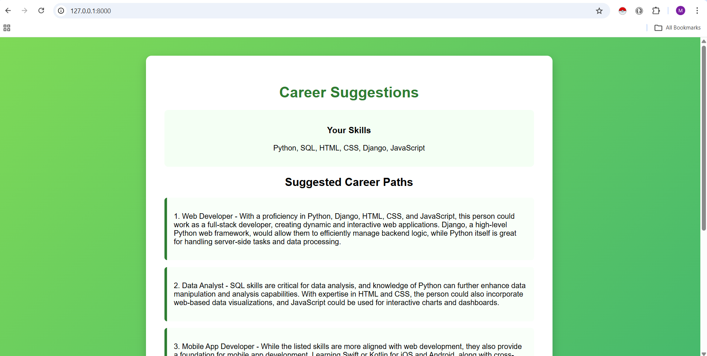
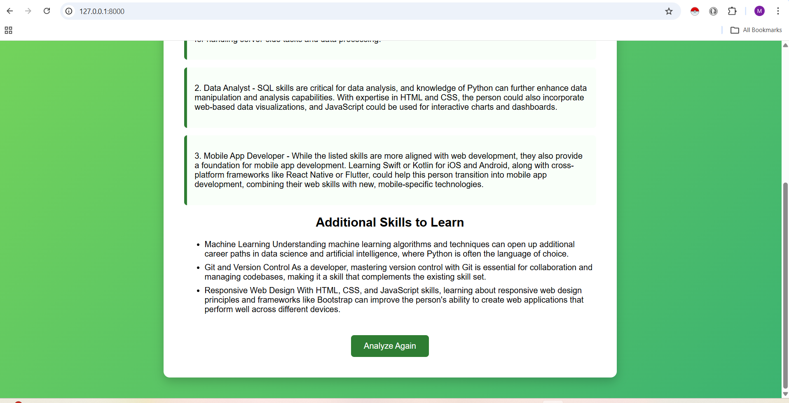

# AI Career Advisor

An AI-powered career recommendation web application that analyzes a user's skills and suggests the most suitable career paths using Python, Django, and Ollama (Phi-3 LLM).This project helps students, freshers, and job seekers discover careers that match their skill sets and identify additional skills they should learn.

## Features

- AI-based career recommendations  
- Skill analysis using LLM  
- Additional skills suggestions  
- Clean and responsive UI  
- Django backend integration  
- Local AI model using Ollama (Phi-3)  
- Fast and simple interface  

## How the System Works

- User enters their skills  
- The system sends the skills to Ollama Phi-3  
- AI analyzes the skillset  
- The system returns  

- Best career paths  
- Additional skills to learn  
- Career guidance  

## Tech Stack

- Python
- Django
- HTML
- CSS
- JavaScript
- Ollama
- Phi-3 LLM

## Project Structure

ai_career_advisor

advisor  
│  
├── migrations  
├── templates  
│   ├── index.html  
│   └── result.html  
│  
├── static  
│   └── style.css  
│         
│  
├── models.py  
├── views.py  
├── forms.py  
├── utils.py  
└── urls.py  

ai_career_advisor  
│  
├── settings.py  
├── urls.py  
└── wsgi.py  

manage.py  
requirements.txt  
README.md  

## Installation and Setup

Follow these steps to run the project locally.

### 1. Clone the Repository

git clone https://github.com/Mursaleen67/ai_career_advisor.git

### 2. Navigate to the Project Folder

cd ai-career_advisor

### 3. Install Required Libraries

pip install -r requirements.txt

### 4. Install Ollama

Download Ollama

https://ollama.com

Pull Phi-3 model

ollama pull phi3

Run model

ollama run phi3

### 5. Run the Django Development Server

python manage.py runserver

### 6. Open the Application

Open your browser and go to:

http://127.0.0.1:8000

## Screenshots

### Chatbot Interface

### Career Result Page

## Example
Input
Python, SQL, HTML, CSS

AI Output
Suggested Careers
- Python Developer
- Data Analyst
- Backend Developer

Additional Skills
- Django
- REST API
- Machine Learning Basics

## Future Improvements
- Resume analysis  
- Skill gap detection  
- Career probability scoring  
- Learning roadmap generation  
- GPT-based AI explanations  

## Author
**Mohammed Mursaleen**

## License
This project is created for learning and educational purposes using Python and Django. No official license is applied..

